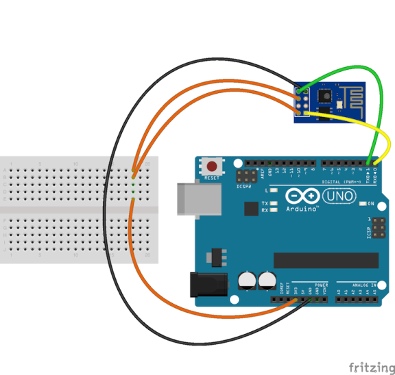

#Connect to thethings.iO with ESP8266 wifi module

This examples have been provided by Hans Crijns [CloudSensor.us](http://cloudsensor.us)

* ESP_theThings.ino: Send a value to thethings.iO
* ESP_theThings_DHT: Send temperature and humidity from a DHT11 temp/hum sensor.

##What you need for standalone ESP8266 Arduino
1. Arduino UNO (as a programmer)
2. ESP8266
3. Some wires, soldering iron and solder to hookup the ESP8266

##Getting Started with standalone ESP8266 Arduino
More info at:  http://makezine.com/2015/04/01/installing-building-arduino-sketch-5-microcontroller/

1. Download and unzip ESP8266 Arduino (does not impact your normal Arduino): https://github.com/esp8266/arduino
2. Open new Arduino IDE and program Arduino UNO with “Bare Minimum” sketch
3. Hookup ESP8266:
Connect with 3V3 (NOT 5V!)
GPIO_0 connected to GND to enable programming (see picture)
4. Select Tools -> Board -> Generic ESP8266 board
5. Select Tools -> Programmer -> esptool
6. Test programming by programming ESP8266WiFi -> WiFiScan & open serial
7. Remove GPIO_0 from GND to have ESP8266 boot without bootloader

##Use with thethings.iO
1. Open a new Sketch and copy ESP_TheThings sketch
2. Get an account with [thethings.iO](https://thethings.io)
3. Generate and copy API key to sketch
4. Change wifi settings for your network
5. Upload like above (don’t forget to insert GPIO_0 again to enable programming  and remove/insert USB)

>Figure: Hooking up ESP8266 with Arduino as a programmer (don’t forget GPIO_0 for programming)
